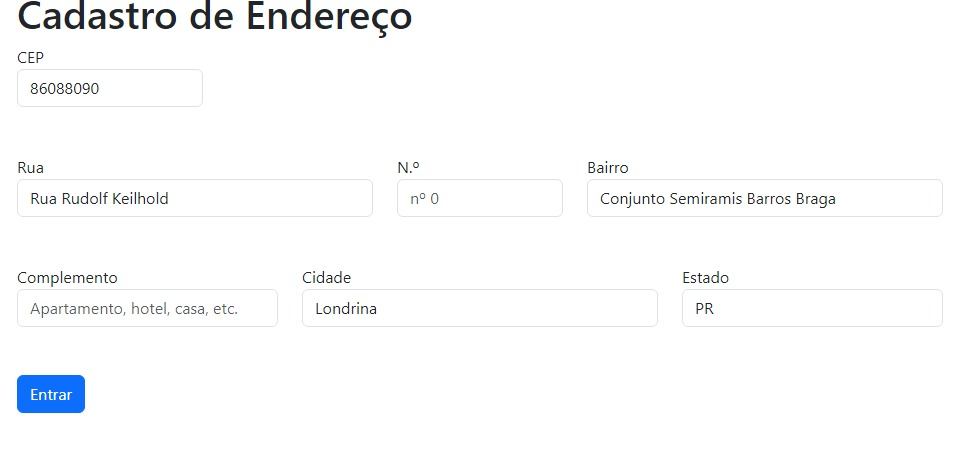

# Form-CardEndereco

[Form-CardEndereco](#form-cardendereco)  
[Descrição](#descri%C3%A7%C3%A3o)  
[Introdução](#introdu%C3%A7%C3%A3o)  
[Funcionalidades](#funcionalidades)  
[Tecnologias utilizadas](#tecnologias-utilizadas)  
[Fontes consultadas](#fontes-consultadas) 
[Autores](#autores)

## Descrição
o meu projeto tem a função de preencher os dados como, rua, bairro, cidade e estado, quando se insere o cep da rua 
## Introdução
o projeto tem a principal funcionalidade de aprendermos como se preenche automoticamente os dados colocando o cep da rua

## Funcionalidades
quando inserimos o número do cep e ele está incompleto ou insere algum número errado, aparece uma mensagem de "CEP incorreto"
 quando inserimos algum número errado no número do cep, aparece uma mensagem "CEP não encontrado"
 quando ficar disponível para limpar todos os campos do formulário, permite que o usuário comece novamente, se necessário.
 quando inserimos o CEP válido e sai do campo CEP, o sistema consulta a API da Via CEP para recuperar automaticamente as informações de rua, bairro, cidade e estado correspondentes ao CEP.

## Tecnologias utilizadas
*CSS
*HTML
*GITHUB
*JAVASCRIPT
*BOOTSTRAP
## Fontes consultadas
chat.openai google
## Autores
[Gabriella Innocencio Gonçalves dos Santos](https://github.com/gaabriellasantoos)
